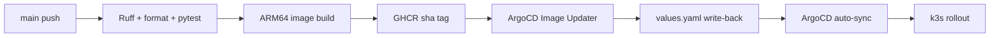

# ssuAgent GitOps 배포와 운영 검증

이 문서는 현재 production 배포 경로와 검증 기준을 설명한다. 요청·신뢰·상태 경계는
[architecture.md](architecture.md), 환경 변수는 [configuration.md](configuration.md)가 기준이다.

## 배포 계약

1. `.github/workflows/ci.yml`이 Ruff, format check와 pytest를 실행한다.
2. 검증이 성공한 `main` SHA만 `ghcr.io/ghdtjdwn/ssuagent:sha-<full-sha>` ARM64 이미지로
   publish된다.
3. ArgoCD Image Updater가 새 SHA tag를 감지해
   `deploy/charts/ssu-agent/values.yaml`의 `image.tag`를 Git에 write-back한다.
4. ArgoCD가 Helm chart를 `ssuai-prod` namespace에 auto-sync하고 rolling update한다.

이미지 publish 성공은 배포 완료를 의미하지 않는다. write-back, ArgoCD reconciliation, 실제 running
image와 health를 모두 확인해야 한다.

## Source of truth

| 대상 | 기준 파일 또는 상태 |
| --- | --- |
| CI와 image gate | `.github/workflows/ci.yml` |
| Kubernetes workload | `deploy/charts/ssu-agent/` |
| 원하는 image SHA | `deploy/charts/ssu-agent/values.yaml` |
| ArgoCD source와 Image Updater annotation | `deploy/argocd/application-ssu-agent.yaml` |
| Secret 이름과 필수 여부 | Helm `secretRef`와 production values |
| 실제 배포 결과 | ArgoCD status, Deployment rollout, running pod image, health endpoints |

## Runtime 경계

- production target은 ARM64 k3s와 `ssuai-prod` namespace다.
- LangGraph checkpoint와 thread owner는 기존 PostgreSQL에 저장한다. pod filesystem은 대화 상태의
  source of truth가 아니다.
- `ssuagent-secrets`는 최소 `DATABASE_URL`, `AGENT_API_KEY`, 한 개 이상의 LLM provider key를
  포함한다. 값은 Git에 두지 않는다.
- production은 `AGENT_API_KEY_REQUIRED=true`, 실제 frontend origin allow-list, non-optional Secret을
  사용한다.
- readiness/liveness는 `/health`, upstream MCP까지 포함한 운영 점검은 `/healthz/deep`을 사용한다.

Secret key 이름과 선택 provider는 Helm의
[`secret.example.yaml`](../deploy/charts/ssu-agent/templates/secret.example.yaml)을 참고한다. 실제 값을
명령 기록, CI log, issue나 문서에 붙여 넣지 않는다.

## Release 검증

다음 순서로 같은 commit SHA를 끝까지 추적한다.

1. `main` CI의 test job 성공
2. 같은 SHA의 ARM64 image build/push 성공
3. Image Updater가 `values.yaml`에 기록한 tag 확인
4. ArgoCD Application의 source repository와 `Synced/Healthy` 확인
5. Deployment rollout 완료와 pod `Ready`, restart count 확인
6. running container image가 기대한 SHA tag인지 확인
7. `/health`와 `/healthz/deep`이 `UP`인지 확인
8. direct no-key `/agent/stream`이 401이고, ssuAI server proxy 경로가 계약에 맞는 상태 코드를
   반환하는지 확인

문서-only 변경은 CI의 `paths-ignore` 대상이므로 새 image나 rollout이 생기지 않는 것이 정상이다.

## 2026-07-18 릴리스 증거

라우팅 평가 계약을 추가한 pull request
[#65](https://github.com/ghdtjdwn/ssuAgent/pull/65)는 main commit
`b1f88e339f6ae081d9580d271747404cfe989721`로 머지됐다. 같은 commit에 대한
[main CI](https://github.com/ghdtjdwn/ssuAgent/actions/runs/29646212353)에서 다음 게이트가
실제로 완료됐다.

- Ruff check와 format check 통과
- pytest 306개 통과
- ARM64 image `ghcr.io/ghdtjdwn/ssuagent:sha-b1f88e339f6ae081d9580d271747404cfe989721`
  build·push 성공
- 별도 [gitleaks check](https://github.com/ghdtjdwn/ssuAgent/actions/runs/29646212349) 통과

ArgoCD Image Updater는 commit `e40fa68e98658d2b87430f35b7202e8a054f6c2a`로
`values.yaml`의 기대 image tag를 `sha-b1f88e339f6ae081d9580d271747404cfe989721`로
write-back했다. 그 후 공개 endpoint의 읽기 전용 probe는 다음과 같았다.

| 점검 | 관찰 결과 |
| --- | --- |
| `GET https://ssuagent.duckdns.org/health` | HTTP 200, `status=UP` |
| `GET https://ssuagent.duckdns.org/healthz/deep` | HTTP 200, `status=UP`, `mcp=UP` |

이 증거는 CI image 생성, GitOps 기대 태그 변경, 그리고 점검 시점의 service·MCP
건강 상태를 각각 확인한다. 다만 ArgoCD와 cluster 관리면은 Tailscale 인증을
요구해 이 검증에서 Application의 `Synced/Healthy`, Deployment rollout, pod `Ready`·restart
수, 실제 running container image SHA를 직접 조회하지 못했다. public health와
Git write-back만으로는 응답한 pod가 해당 SHA를 실행 중임을 증명할 수 없으므로,
이 릴리스의 직접 확인 범위는 배포 검증 순서 1∼3과 7까지다.

## Rollback

정상 rollback은 cluster에서 image를 직접 바꾸는 작업이 아니라, `values.yaml`의 image tag를 마지막으로
검증된 SHA로 되돌리는 Git commit이다. ArgoCD가 이 Git 상태로 reconciliation하게 한다.

ArgoCD나 Image Updater 자체가 고장 난 break-glass 상황에서는 먼저 auto-sync 영향과 현재 serving pod를
확인한다. production pod restart, 강제 replace, 수동 image patch는 별도 승인과 rollback 계획 없이
실행하지 않는다. 복구 후에는 반드시 version-controlled manifest와 live Application의 drift를 없앤다.

## 현재 운영 제약

- replica는 1개다. process-local rate limit 때문에 무검증 scale-out은 사용자별 quota를 보장하지 못한다.
- PostgreSQL checkpointer는 pod 재시작 후 대화를 보존하지만, schema/setup과 connection pool 상태도
  readiness와 별도로 확인해야 한다.
- `/health`는 process liveness에 가깝다. MCP 연결을 포함한 종단 준비 상태는 `/healthz/deep`이 더 강한
  근거다.
- Secret과 Vercel proxy wiring은 repository CI가 검증하지 못한다.

## 운영 사례: ArgoCD Application drift

### 상황과 영향

2026-07-15, commit `498ddb0`의 CI와 ARM64 image publish는 성공했지만 production은 이전 image를 계속
실행했다. ArgoCD는 `Synced/Healthy`였기 때문에 표면 상태만 보면 정상 배포처럼 보였다. 기존 Ready pod가
계속 serving해 외부 중단은 없었지만, 새 코드가 배포되지 않은 상태였다.

### 증거와 원인

- Git의 Application manifest는 현재 owner `ghdtjdwn`의 repository와 GHCR image를 가리켰다.
- cluster에 남은 live Application은 이전 owner의 repository와 image-list annotation을 유지했다.
- Image Updater log는 해당 image를 반복해서 `skipped` 처리했고 `values.yaml` write-back이 없었다.
- 따라서 `Synced/Healthy`는 stale source와 일치한다는 뜻이었을 뿐, 기대한 SHA가 실행 중이라는 근거가
  아니었다.

root cause는 version-controlled Application과 live ArgoCD Application 사이의 control-plane drift였다.
수동 `kubectl set image`나 pod restart는 GitOps source of truth를 더 흐리므로 해결책에서 제외했다.

### 해결과 검증

version-controlled `deploy/argocd/application-ssu-agent.yaml`을 재적용해 source repository와 Image
Updater annotation을 복구했다. 이후 Image Updater write-back, ArgoCD rolling update, running image
SHA, `1/1 Ready`, restart 0, `/health`, `/healthz/deep`, no-key 401을 순서대로 확인했다.

회귀 방지를 위해 release 검증에서 ArgoCD 상태만 보지 않고 source URL, image-list annotation, chart
tag와 running image SHA를 함께 대조한다.
